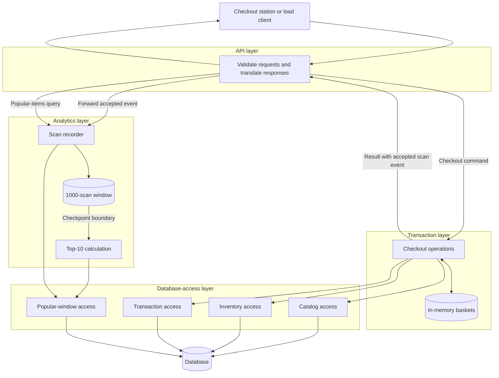
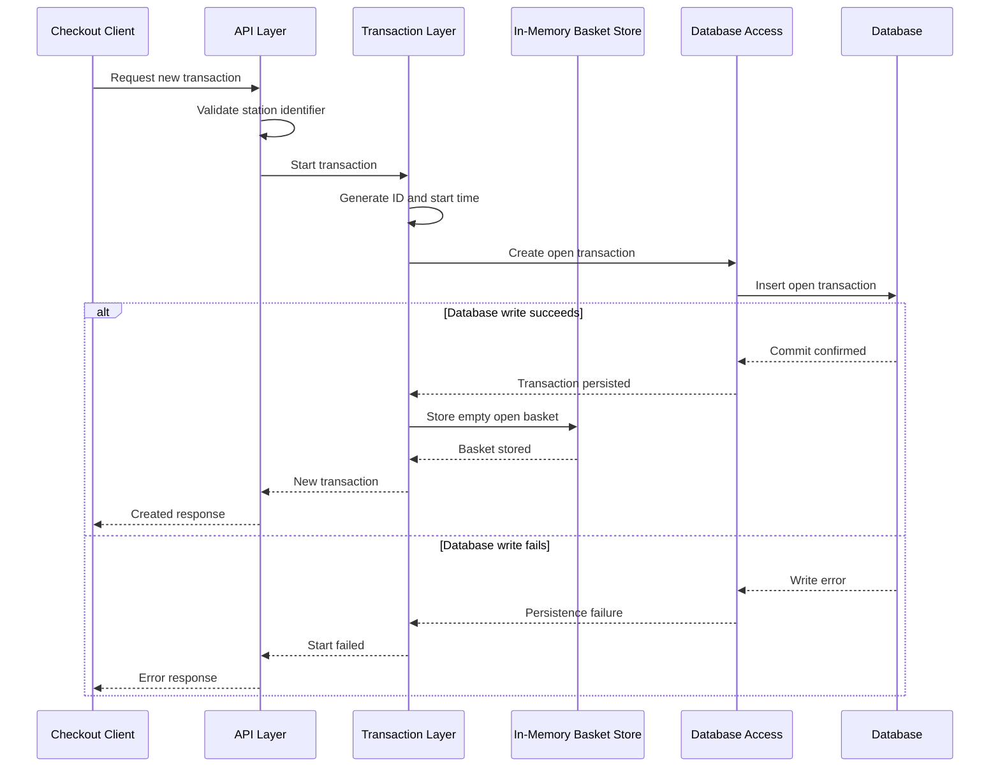
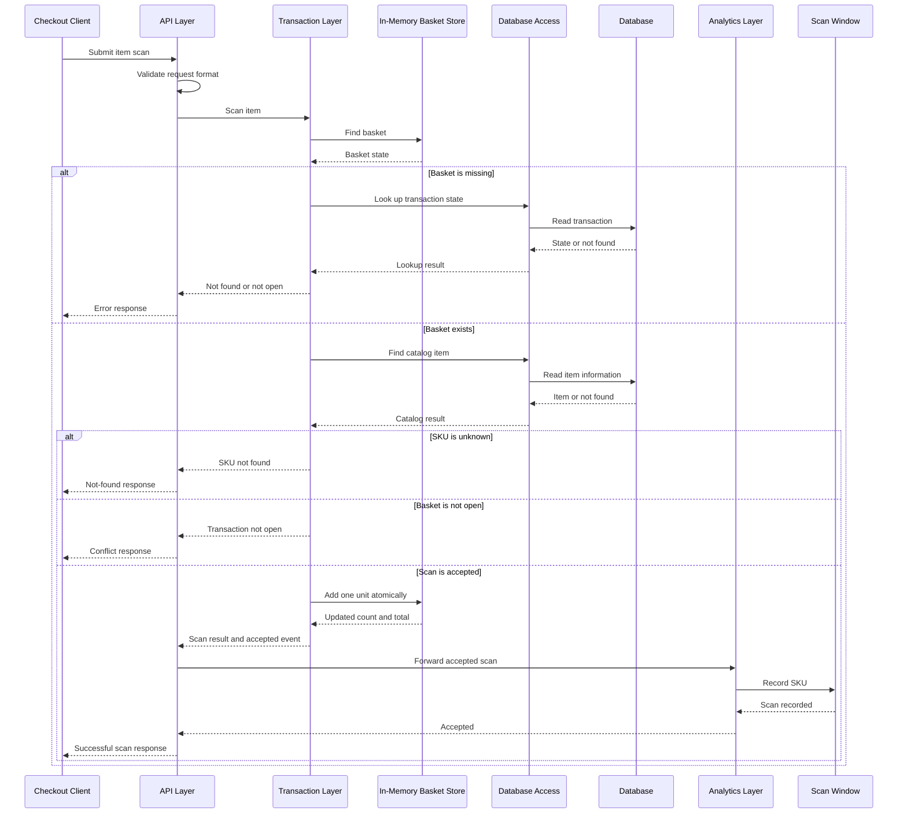
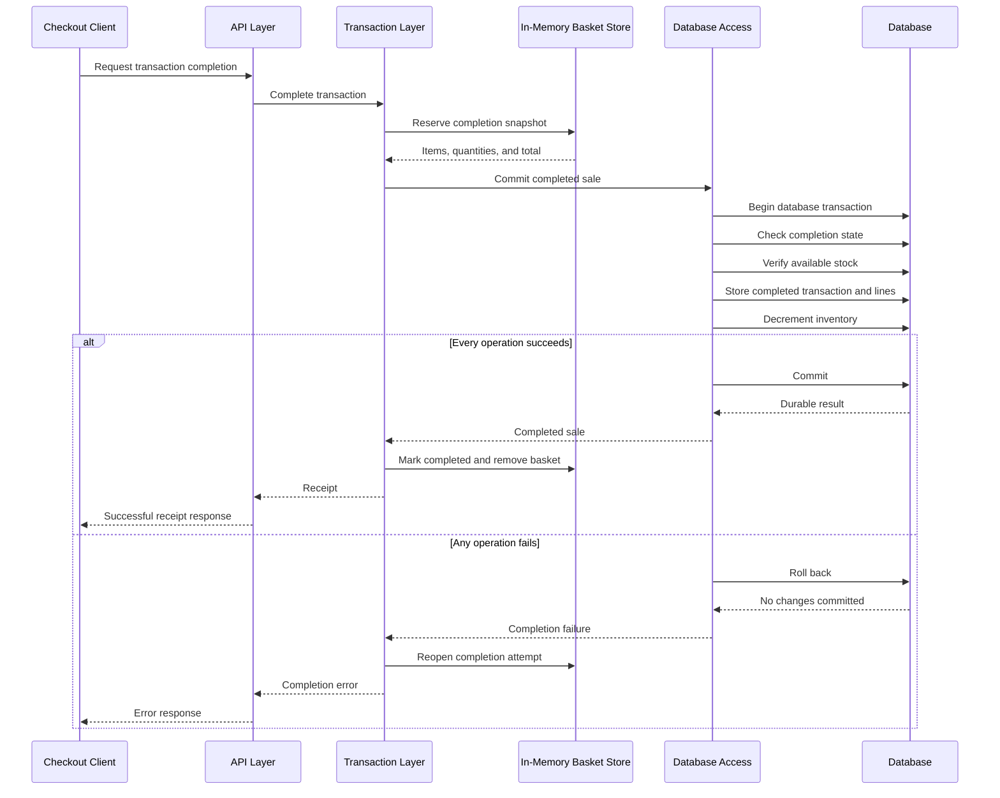
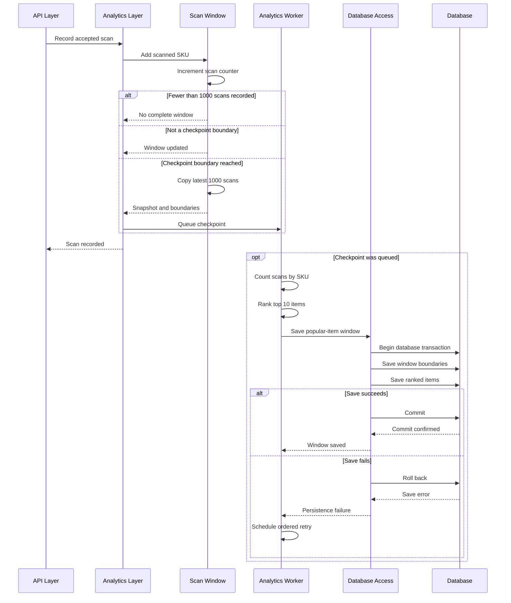
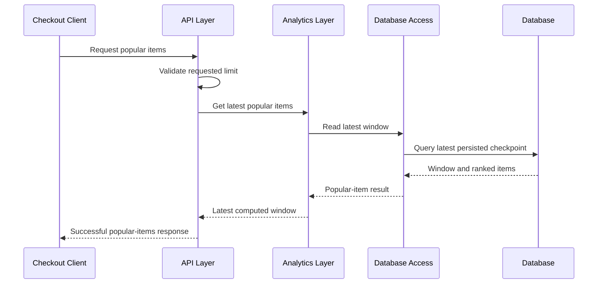

# Layered Architecture Data Flow

This document describes the target runtime data flow for the migration from the existing
monolithic server to the four-layer design required by the project constitution.

The diagrams show logical responsibilities and boundary crossings. They do not prescribe
specific classes or frameworks.

## Architecture Overview

The API layer performs transport-related work only. The transaction and analytics layers own
business behavior, while the database-access layer is the sole boundary for durable reads and
writes.

## Start Transaction

The server returns a transaction identifier only after the open transaction has been accepted.
No basket is created when persistence fails.

## Scan Item

Only accepted scans reach analytics. Scanning changes the in-progress basket but does not
decrement durable inventory.

## Complete Transaction

The stock checks, stock decrements, transaction record, transaction lines, and idempotency
decision form one atomic durable operation. A successful response is returned only after commit.

## Analytics Ingestion and Recalculation

A complete 1,000-scan window is first available at scan 1,000. A new checkpoint is then created
after each additional 500 accepted scans. Scan requests do not wait for checkpoint persistence.

## Retrieve Popular Items

The response represents the latest successfully persisted checkpoint. Scans recorded after that
checkpoint are not included until the next checkpoint has been computed and saved.

## Boundary Rules

- The API layer never reads or writes the database directly.
- The API layer forwards an accepted scan event; it does not decide whether a scan is accepted.
- The transaction layer owns basket state, pricing, completion, idempotency, and inventory
  consistency.
- The analytics layer owns the scan counter, rolling window, checkpoint schedule, ranking, and
  popular-item result.
- The database-access layer owns all database statements, transaction boundaries, and durable
  mappings.
- Results and errors return outward through explicit layer contracts; lower layers never depend
  on the API layer.
